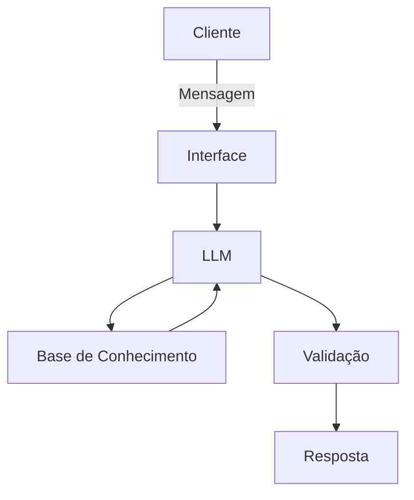

## Documentação do Agente

### Caso de Uso

#### Problema
> Qual problema financeiro seu agente resolve?

Muitas pessoas vivem com ansiedade financeira, sem clareza dos seus gastos, o que gera estresse, falta de controle e dificuldade em atingir objetivos como economizar ou investir.

#### Solução
> Como o agente resolve esse problema de forma proativa?

O agente funciona como um assistente financeiro pessoal que analisa informações fornecidas pelo usuário, como gastos, metas e hábitos financeiros, para oferecer orientação prática e acessível.

A inteligência do agente roda localmente por meio de um modelo LLM executado via Ollama, reduzindo custos com APIs externas e aumentando a privacidade dos dados.

Além disso, o agente pode gerar insights sobre padrões de consumo, ajudando o usuário a tomar decisões mais conscientes ao longo do tempo.

#### Público-Alvo
> Quem vai usar esse agente?

- Jovens adultos (18–35 anos)
- Pessoas que querem começar a se organizar financeiramente
- Iniciantes em investimentos
- Pessoas que ganham pouco/médio e precisam otimizar gastos

---
### Objetivos do Agente

#### Objetivo Geral

Ajudar o usuário a organizar sua vida financeira, trazendo clareza sobre seus gastos, controle do dinheiro e apoio na construção de hábitos financeiros mais saudáveis.

#### Objetivos Específicos

- Auxiliar no registro e organização de receitas e despesas
- Categorizar automaticamente os gastos do usuário
- Identificar padrões de consumo ao longo do tempo
- Sugerir melhorias simples para economia no dia a dia
- Ajudar o usuário a definir e acompanhar metas financeiras
- Gerar insights sobre comportamento financeiro
- Incentivar decisões financeiras mais conscientes

---

### Persona e Tom de Voz

#### Nome do Agente
Finny

#### Personalidade
> Como o agente se comporta? (ex: consultivo, direto, educativo)

Consultivo, educativo e motivador. O agente atua como um guia financeiro que orienta sem julgamento, incentivando o usuário a melhorar sua relação com o dinheiro de forma leve e prática.

#### Tom de Comunicação
> Formal, informal, técnico, acessível?

Acessível, amigável e levemente informal, evitando termos técnicos complexos e priorizando clareza.

#### Exemplos de Linguagem
- Saudação: "Oi! Vamos organizar sua vida financeira hoje?"
- Confirmação: “Perfeito, entendi! Já estou analisando isso pra você.”
- Erro/Limitação: “Não tenho essa informação no momento, mas posso te ajudar a organizar ou analisar com base no que você me disser!”

---

### Arquitetura

#### Diagrama

#### Componentes

| Componente | Descrição |
|------------|-----------|
| Interface | Chatbot em Streamlit |
| LLM | Modelo local executado via Ollama |
| Base de Conhecimento | Dados financeiros do usuário (JSON/CSV) |
| Validação | Regras para evitar respostas incorretas |

---

### Segurança e Anti-Alucinação

#### Estratégias Adotadas

- [x] O agente roda localmente, reduzindo exposição de dados a serviços externos
- [x] O agente responde apenas com base nos dados fornecidos pelo usuário
- [x] Quando não sabe, admite claramente
- [x] Evita suposições financeiras
- [x] Não recomenda investimentos sem entender o perfil do usuário
- [x] Prioriza organização antes de recomendação
- [x] Limita respostas ao escopo de finanças pessoais básicas
- [x] Evita recomendações sensíveis sem contexto suficiente

#### Limitações Declaradas
> O que o agente NÃO faz?

- Não substitui um consultor financeiro profissional
- Não realiza investimentos automaticamente
- Não acessa contas bancárias reais (sem integração)
- Depende das informações fornecidas pelo usuário
- Não garante resultados financeiros

---
### Vantagem técnica

#### Justificativa da Escolha Tecnológica

Foi escolhida uma arquitetura com LLM local via Ollama para reduzir custos operacionais, permitir maior controle sobre a execução do modelo e evitar dependência de serviços pagos externos. Essa escolha também favorece privacidade, já que os dados do usuário podem ser processados localmente.

---

### Diferenciais do Agente

- Execução local com baixo custo (sem dependência de APIs pagas)
- Foco em educação financeira simples e acessível
- Abordagem sem julgamento, incentivando o usuário de forma positiva
- Capacidade de gerar insights com base no comportamento do usuário
- Simplicidade de uso para iniciantes
- Foco em privacidade dos dados do usuário

---

### Possíveis Evoluções Futuras
- Integração com APIs bancárias
- Dashboard visual de gastos
- Notificações automáticas de comportamento financeiro
- Personalização baseada no perfil do usuário
- Versão mobile

---

### Considerações Finais

O agente foi projetado com foco em simplicidade, acessibilidade e baixo custo, visando atender usuários que estão iniciando sua jornada de organização financeira. A escolha por um modelo local reforça o compromisso com privacidade e viabilidade técnica, tornando o projeto escalável para futuras evoluções.
